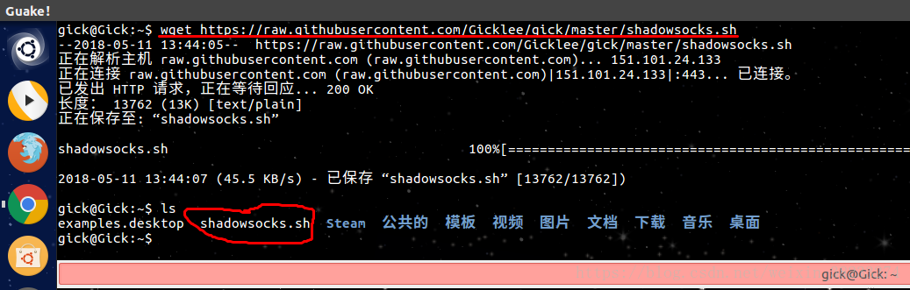

# ShDevTools
shell devtools for git ; docker ; npm

# rep目标
### docker的常用脚本
### git常用脚本

# 直接快速wget下载sh文件和运行方法
1. 打开github页面
2. 点击文件浏览，并点击`raw`,然后查看url显示的地址
3. `复制`url地址
4. 使用`wget url地址`完成`sh`文件下载
5. 运行下载的`sh`文件 

